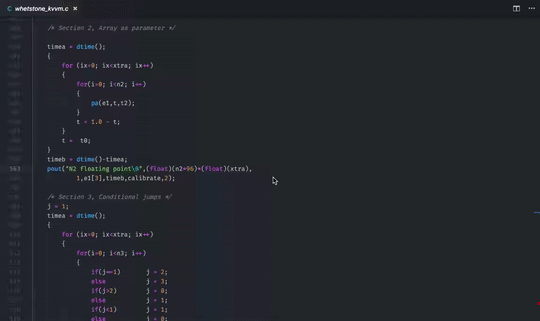

# Disassembly Explorer

Shows disassembly to source relations and dims unused source lines.

This extension is based on [Compiler Explorer](https://github.com/mattgodbolt/compiler-explorer)
(especially on AsmParser class from it).



## Usage

At first, you need disassembly of your source files. That's because the
extension do not know anything about your project structure, compiler and
compilation flags.

Regular disassembly may be generated with:

    $(CC) -g -o disassembly.S $(CFLAGS) -S source.c

Objdumped disassembly should be generated with lines info:

    objdump -d compiled.bin -l > disassembly.S

Next, when you generated disassembly, you should tell to extension, where to
search disassembly. By default it is searched right near the source file, but
with `.S` extension:

```json
"disasexpl.associations": {
    "**/*.c": "${fileDirname}/${fileBasenameNoExtension}.S",
    "**/*.cpp": "${fileDirname}/${fileBasenameNoExtension}.S"
}
```

Now, when all is done, simply select `F1 > Disassembly Explorer: Show`.
Disassembly will be opened on the right side of your source.

## TODO

- [ ] Provide links for lines like `ja 24a7 <rasterize+0x7d7>`
- [ ] Colorize source and asm lines as in Compiler Explorer
